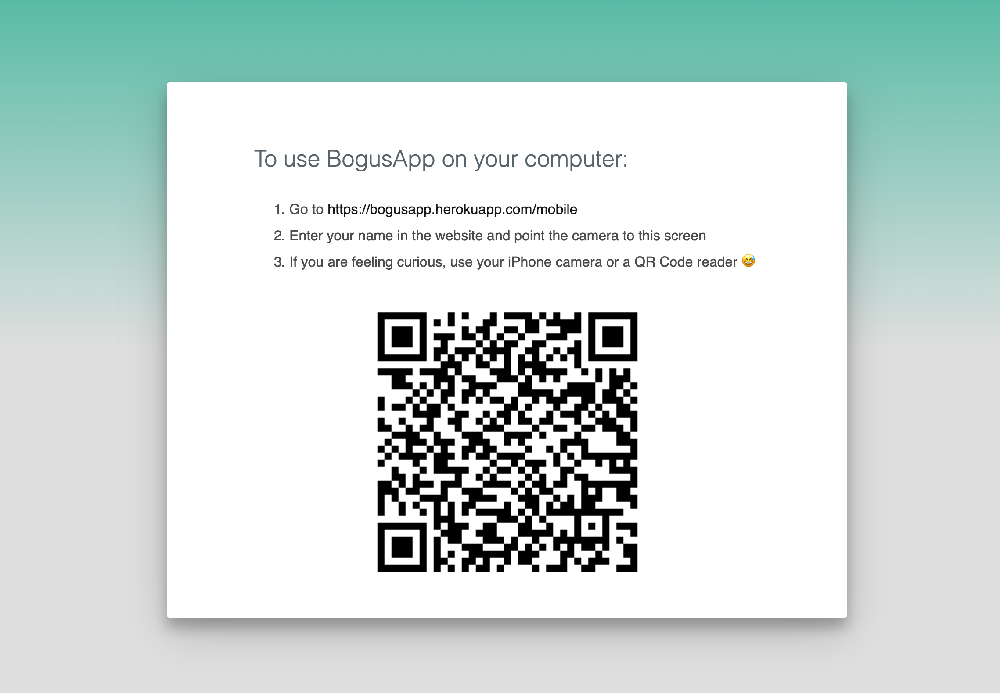
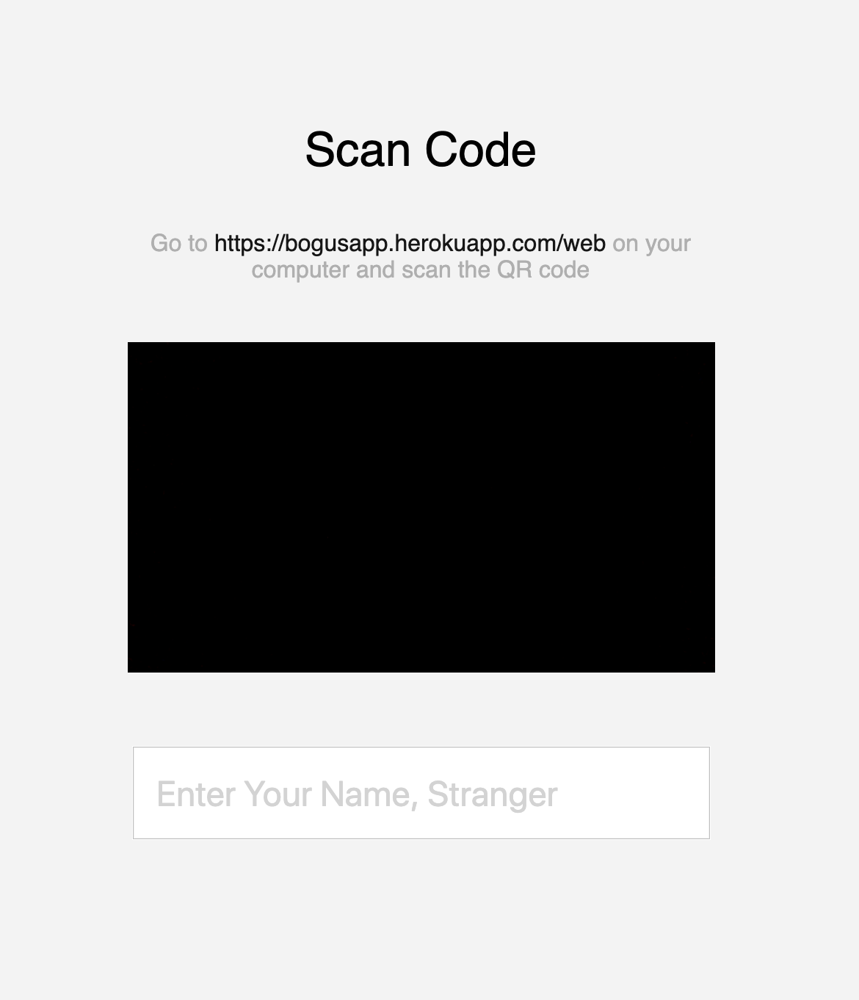

# BogusApp

Got curious about QR code login so here's my bogus whatsapp login attempt. 😬

## Web App

Open this url in your computer to attempt to do a QR code login:
[https://bogusapp.herokuapp.com/web](https://bogusapp.herokuapp.com/web)

## Mobile App

Open this browser in your phone to simulate a logged in mobile app:
[https://bogusapp.herokuapp.com/mobile](https://bogusapp.herokuapp.com/mobile)

## Camera

Using your iPhone Camera or QR Code reader.
Just scan the QR code using your iPhone camera or Qr code reader, that should work too.

## FAQ

Just for fun.
